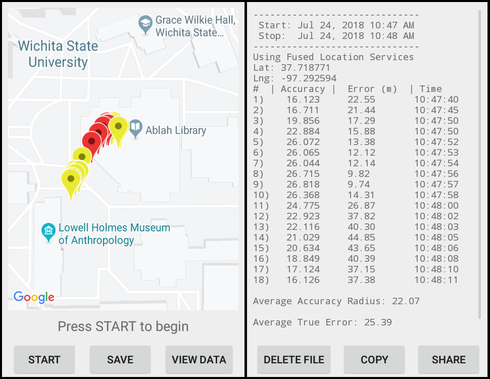

# Mapping_GPS - Android App
## Purpose
- Makes it possible to test phone potitioning capabilities or GPS signal at a certain location.1
- Allows user to see error values of mobile phone positioning methods
- Allows all collected data to be exported as a .txt file
## Location Methods that app supports testing for:
* GPS
* GPS with high accuracy criteria
* Fused Location Services
## Use
- When launching, use specifies location refresh rate, positioning mehtod (see above), and their true latitude and longitude coordinates (if known).
- Once this is selected, user presses START button to begin retreiving location data. 
- At this point, the location readings of the phone are plotted on a map with labels corresponding the the estimated accuracy reading as given by Android's getAccuracy() function.
- The readings can be paused/restarted.
- Once paused, the data can be written to a .txt file by pressing SAVE. This data can be viewed by pressing VIEW DATA.
## Data Collection
- The .txt file where the data is saved contains the following info:
  - Start and stop times of the data collection
  - Lat and Lng values entered by the user (if applicable)
  - Average accuracy radius as given by getAccuracy() function2
  - Average true error calculated using user's inputted Lat Lng values (if applicable)
  - Each data point, which consists of:
    - point number
    - accuracy reading given by getAccuracy() function
    - True error between Lat Lng readings and user's inputted Lat Lng readings (if applicable)
    - Time that the data point was collected
- The data can be exported as a .txt file by clicking SHARE while viewing the data.
- The data can be copied to the clipboard by clicking COPY.
- The data can be cleared by clicking DELETE.
## Screenshots
Below are two screenshots. The left shows the app running with the labels on the map corresponding to where the phone's estimated location is. The right shows the contents of the .txt with all of the data recorded.

## Notes
1. You need to include a Google Maps API key in the googe_maps_api.xml file in place of "YOUR_KEY_HERE" for this app to work.
2. An explanation of the getAccuracy() funciton can be found at: https://developer.android.com/reference/android/location/Location#getAccuracy()
