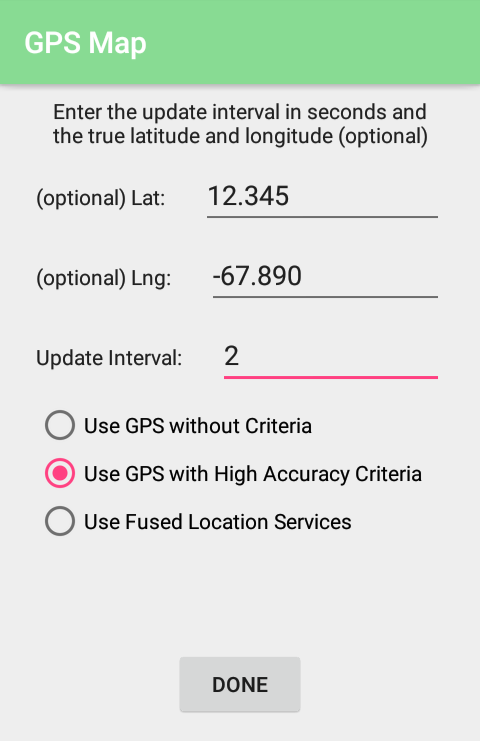

# Mapping_GPS - Android App
## Purpose
- Makes it possible to test phone positioning capabilities or GPS signal at a certain location.1
- Allows user to see error values of mobile phone positioning methods
- Allows all collected data to be exported as a .txt file
- Created: June 2018
- Last Updated: July 2018
## Location Methods that app supports testing for:
* GPS
* GPS with high accuracy criteria
* Fused Location Services (combines services like cellular, GPS, etc.)
## Use
- When launching, the user specifies location refresh rate, positioning method (see above), and their true latitude and longitude coordinates (if known).
- Once this is selected, user presses START button to begin retrieving location data.
- At this point, the location readings of the phone are plotted on a map with labels and colors corresponding to the estimated accuracy reading as given by Android's getAccuracy() function.
    - Green pin: < 10m estimated accuracy
    - Yellow pin: 10-25m estimated accuracy
    - Red pin: 25-100m estimated accuracy
- The readings can be paused/restarted.
- Once paused, the data can be written to a .txt file by pressing SAVE. This data can be viewed by pressing VIEW DATA.
## Data Collection
- The .txt file where the data is saved contains the following info:
  - Start and stop times of the data collection
  - Lat and Lng values entered by the user (if applicable)
  - Average accuracy radius as given by getAccuracy() function2
  - Average true error calculated using user's inputted Lat Lng values (if applicable)
  - Each data point, which consists of:
    - point number
    - accuracy reading given by getAccuracy() function
    - True error between Lat Lng readings and user's inputted Lat Lng readings (if applicable)
    - Time that the data point was collected
- The data can be exported as a .txt file by clicking SHARE while viewing the data.
- The data can be copied to the clipboard by clicking COPY.
- The data can be cleared by clicking DELETE.
## Screenshots
### Initialization UI
This is what the user sees when starting the app. Here, they have the option to enter the true latitude and longitude values if they are known. The update intervals is in seconds and can be set to 0 to take readings as fast as possible.

### Operating and Data Recording UI
The left image shows the app running with the labels on the map corresponding to where the phone's estimated location is. The right shows the contents of the .txt with all of the data recorded. In this example, the user had provided the true latitude and longitude values at startup so the app was able to calculate and display the true error. The column labels in left image are:
- "#": data point number
- "Accuracy": accuracy radius estimated by Google's built-in getAccuracy() function (see note number 2)
- "Error": true error (i.e. distance between GPS Lat Lng and user-provided true Lat Lng values)
- "Time": timestamp of data point

## Notes
1. You need to include a Google Maps API key in the google_maps_api.xml file in place of "YOUR_KEY_HERE" for this app to work.
2. An explanation of the getAccuracy() function can be found <a href="https://developer.android.com/reference/android/location/Location#getAccuracy()">here</a>.
